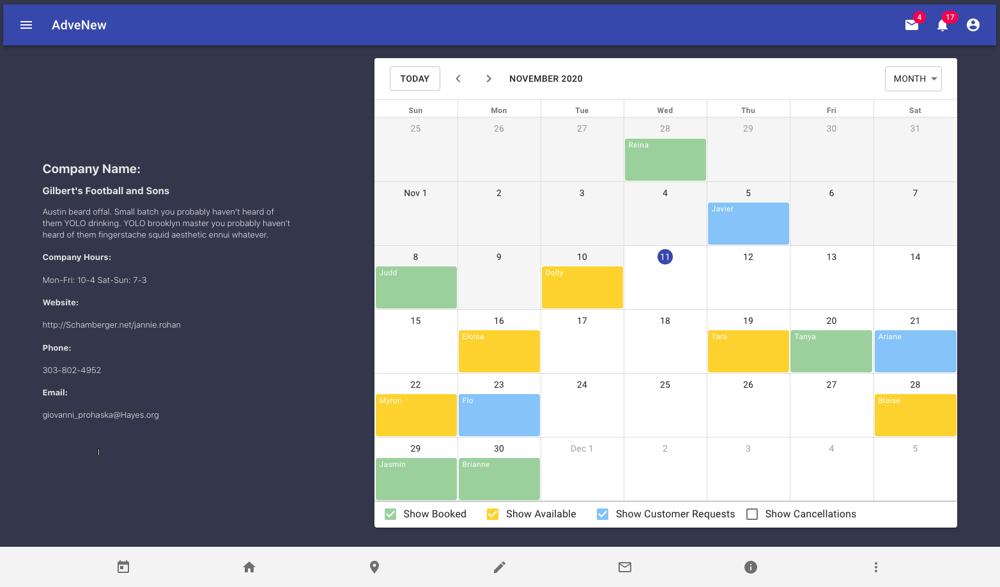

# AdveNew-v1
Web Application for hosted services

### Requirements
Install: 
- npm >=6.14.8 (check with `npm -v`)
- MongoDB >=4.2.7 (check with `mongo -version`)

### Development
Once repo is cloned/pulled, run the follow commands in the root directory of the project (where `package.json` is)
- `npm install`: installs dependencies

### Execution
Before starting the server or bundling the front end, make sure to seed the database `npm run seed`. This will fill the database with 100 stores and 100 customers. (or whatever amount) as a side note make sure mongodb has started if you installed for the first time

To get the server up and running, run any combination of 1 even and 1 odd command (two different cmd windows). While developing, it's best to run #3 and #4.
1. `npm start`: starts express server, doesn't watch for updates
2. `npm run build`: creates a bundle of any react code to serve up
3. `npm run start-dev`: starts express server, watches for updates
4. `npm run build-dev`: creates a bundle of any react code to serve up, rebundles on any save within client/src directory
5. To help with quicker development, use the cmd `npm run dev` to get the server and webpack going together.

Note: Make sure to start mongoDB as well. If installed with homebrew (Mac), `brew services start mongodb-community`

### Sub Readme's
- [Server Readme](/server/README.md)
- [Database Readme](/database/README.md)
- [Client (Front end) Readme](/client/README.md)

### Demo v0.0.03 (11/11)
